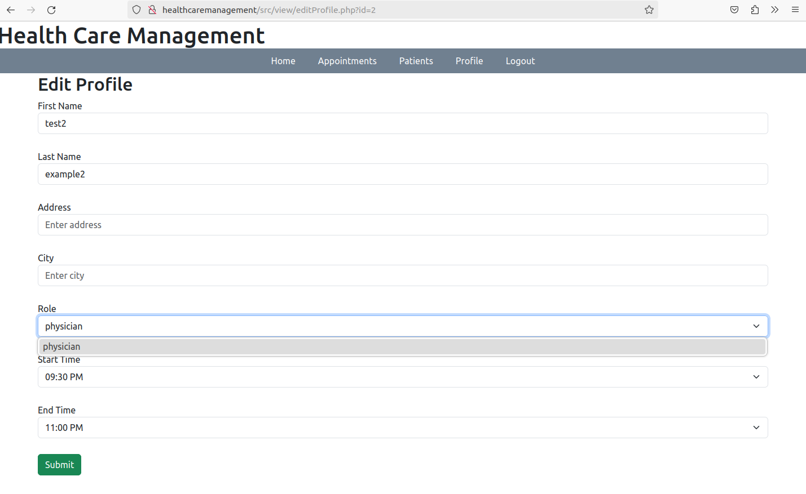
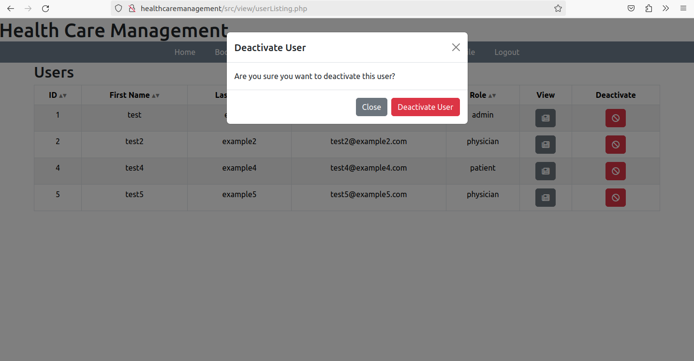
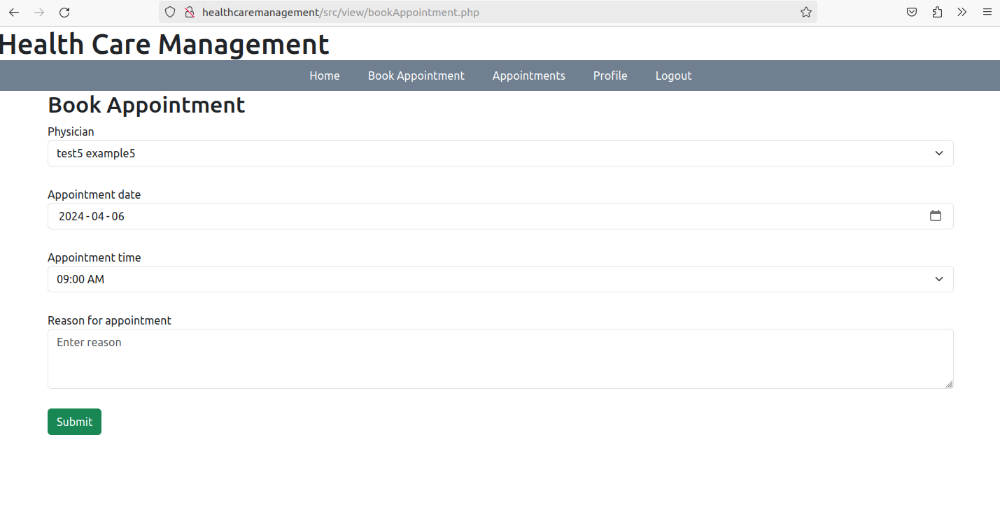
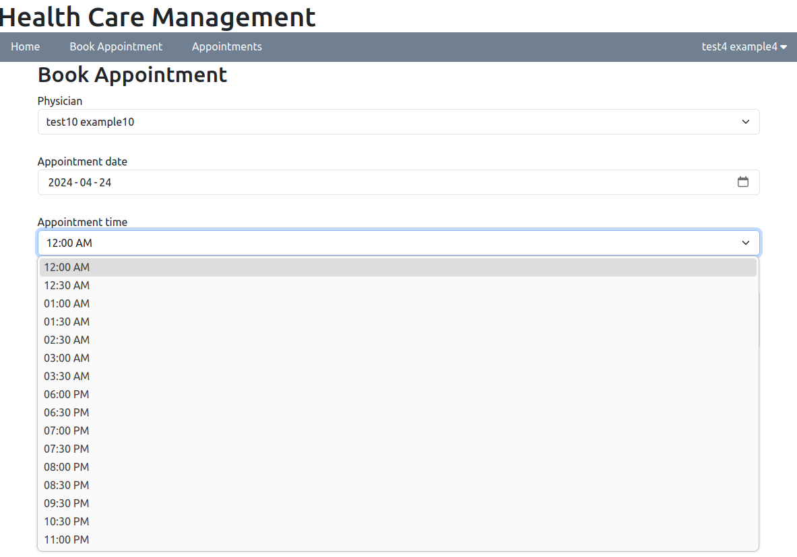
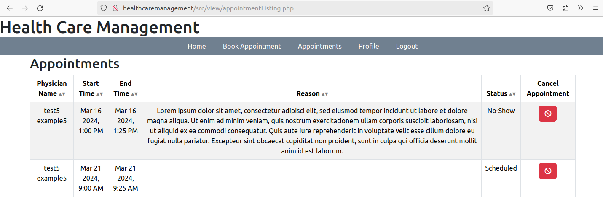
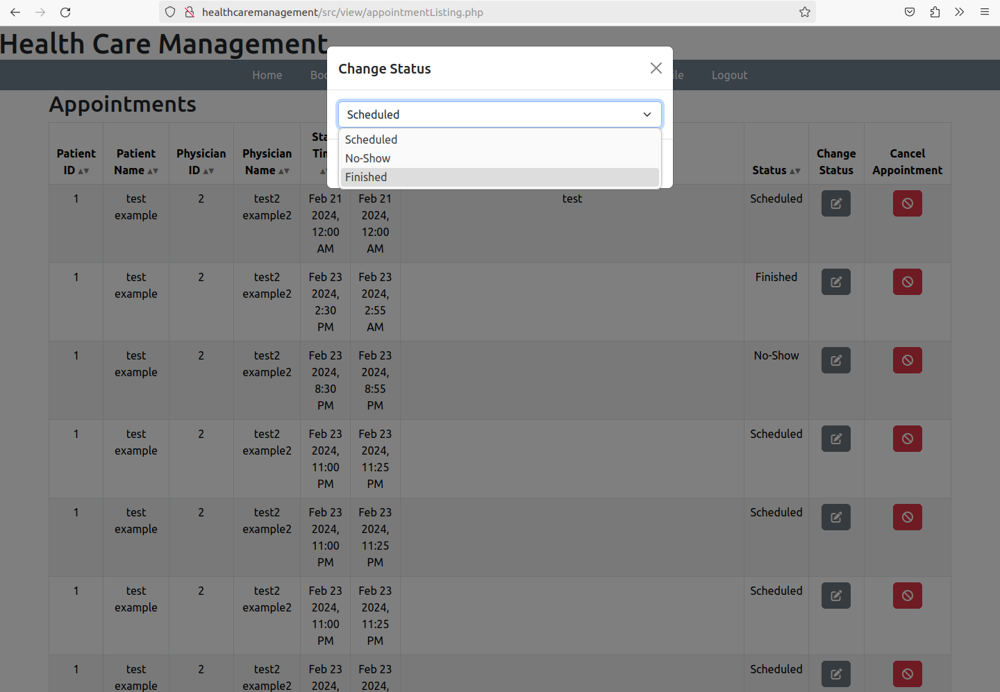

# HealthCareManagement

### Code Setup
To setup the app through Apache, clone the repository to /var/www. Then create a file named HealthCareManagement.conf in /etc/apache2/sites-available/. Set up the file so that it looks like this.
```
<VirtualHost *:80>
	ServerName HealthCareManagement
	ServerAlias www.HealthCareManagement
	DocumentRoot /var/www/HealthCareManagement/laravel-app/public/

    <Directory /var/www/HealthCareManagement/laravel-app/public/>
        AllowOverride All
        Require all granted
    </Directory>

	ErrorLog ${APACHE_LOG_DIR}/error.log
	CustomLog ${APACHE_LOG_DIR}/access.log combined

</VirtualHost>
```
Then activate the file (sudo a2ensite HealthCareManagement.conf), enable mod_rewrite for apache (sudo a2enmod rewrite) and restart Apache (systemctl restart apache2). Finally, Add the line 'LOCAL_IP HealthCareManagement' to /etc/hosts (where LOCAL_IP is your local ipv4 address). You can now get to the app with the url 'http://HealthCareManagement'.

You may also need to do this command in order for www-data to write logs:
```
sudo chown -R www-data:www-data /var/www/HealthCareManagement/laravel-app/storage
```

### Database Setup
Navigate to HealthCareManagement/laravel-app. Edit .env to have these database settings (Use your DB username and password):
```
DB_CONNECTION=mysql
DB_HOST=127.0.0.1
DB_PORT=3306
DB_DATABASE=HealthCareManagement
DB_USERNAME=root
DB_PASSWORD=
```

To setup mysql, first login and run the command:
```
CREATE DATABASE HealthCareManagement;
```
Then exit out of mysql, and in the command line run the commands:
```
php artisan migrate
php artisan db:seed
```

Run this command to populate the timezone table:
```
mysql_tzinfo_to_sql /usr/share/zoneinfo | mysql -u root mysql
```

Create a new file called config.php based on configExample.php.

This is an ER Diagram for the database.


# Website Overview

This website has a role and permissions system, giving different access levels to different users.
- Admins have access to everything. Notably, they can change the roles of different users.
- Patients can edit their profiles, book appointments, and view/cancel their appointments.
- Physicians can view/cancel appointments, change appointment statuses, edit their profiles, and set their availability.
- Guests only have access to the home page.

### Edit Profile Page

This is the edit profile page for physicians:


### User Listing Page

This is the user listing where Admins can deactivate users:


### Book Appointment Page

This is the book appointment page. Patients can select a physician to have an appointment with, and they can select a time that the physician is available. This availability depends on both the physician's availability in their profile, and the other appointments that have been booked with the physician:



### Appointment Listing Page

The appointment listing shows all appointments relevant to a user. Patients can view appointments they have booked, physicians can view appointments that patients have booked with them, and admins see all appointments. Physicians and admins can also change the status of the appointment.

This is what the appointment listing looks like for a patient.


This is what the appointment listing looks like for an admin.
