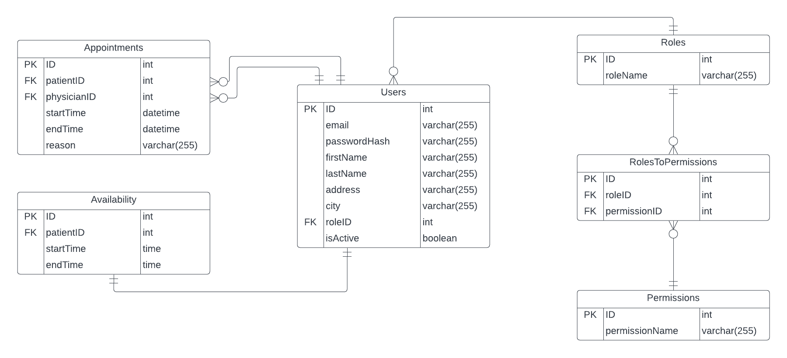

# HealthCareManagement

To setup the app through Apache, clone the repository to /var/www. Then create a file named HealthCareManagement.conf in /etc/apache2/sites-available/. Set the ServerName to HealthCareManagement and the DocumentRoot to /var/www/HealthCareManagement. Then activate the file (sudo a2ensite HealthCareManagement.conf) and restart Apache (systemctl restart apache2). Finally, Add the line 'LOCAL_IP HealthCareManagement' to /etc/hosts (where LOCAL_IP is your local ipv4 address). You can now get to the app with the url 'http://healthcaremanagement'.

To setup mysql, first login and run the command:
    'CREATE DATABASE HealthCareManagement;'
Then exit out of mysql, create a new file called setup.sh based on setupExample.sh, and run the bash command:
    'bash setup.sh'

Create a new file called config.php based on configExample.php.

This is an ER Diagram for the database.
